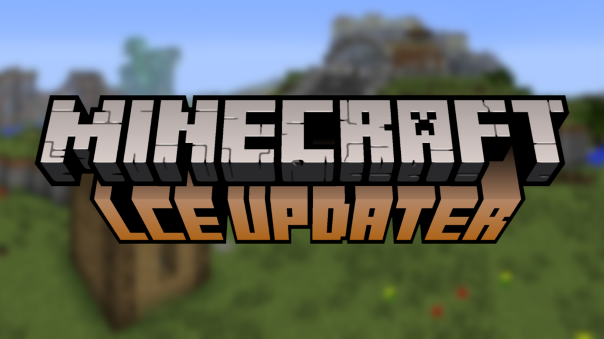

# LCE Updater

# Tool is broken right now because the project got moved to cmake

Original LCE source code that this program compiles:  
  

**LCE Updater** is an installer/updater/compiler for the Minecraft Legacy Console Edition.  

> **Note:** This is **Windows only** for now.

---

## Requirements

> **Note:** If you want to run the .py you need python installed.
- Visual Studio 2022  
- Visual Studio Workload: **Desktop Development with C++**  
- Internet connection

---

## Usage

1. Download the zip from [Releases](https://github.com/NITROMASK/LCE-Updater/releases/).  
2. Unpack the zip into a folder (preferably on your Desktop) and name the folder whatever you like.  
3. Drag and drop the file from the zip into the folder you just created.  
4. Open `LCE Updater.exe`.  
5. Select the branch you want to use.  
6. Let it do its thing (this may take some time—be patient!).  
7. Once it's done, launch the main `.exe` file.

---

## Info

> **Tip:** You can use `--zip` when running from the command line to specify the source code repo zip if it doesn't download automatically.  
> It's recommended to use the `main` branch, but you can try other branches if the build fails.

---

## TO DO

- Add more command-line options  
- Open to suggestions and contributions  

---

## Credits

- **[Defendex](https://github.com/sirdefendex)** – Banner and `.exe` icon  

---

## Contributions

Contributions via pull requests or issues are **highly appreciated**.
