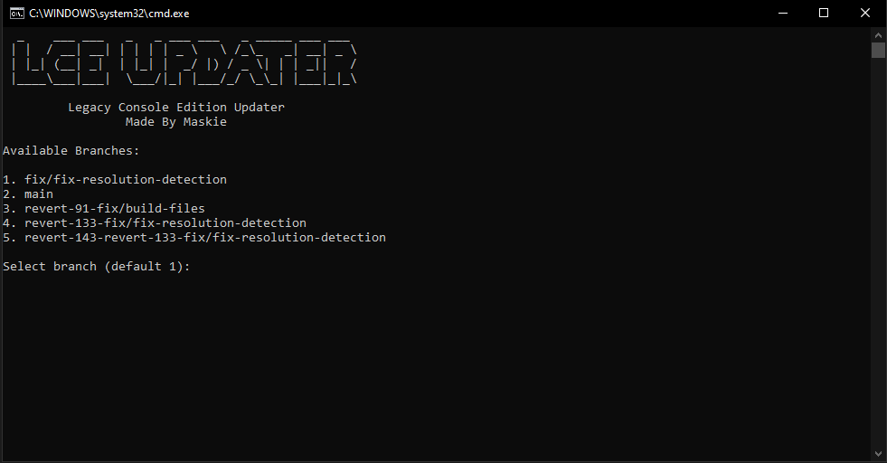

# LCE Updater
Original LCE Source code that this program is Compiling:  [](https://github.com/smartcmd/MinecraftConsoles)  
LCE Updater is a installer/Updater for the Minecraft Legacy Console Edition  

### THIS IS WINDOWS ONLY FOR NOW!



## Requirements:
- Visual Studio 2022
- Visual Studio Workload (Desktop Development with C++)
- Python (newest version or 3.13)
- pip
- Internet Connection

## Usage:
```1. Download the zip```  
```2. Unpack the zip into a folder preferably on the desktop and name the folder what you want```  
```3. Drag and Drop The files from the zip to the folder that you created```  
```4. Open Launch.Bat```  
```5. Select The Branch (i recommend using main and if something breaks in the build try other ones)```  
```6. Let it do its thing (the process can take some time be patient!)```  
```7. After its done just launch the exe file```  

## INFO:
You can do --zip while running it from cmd to specify the Source Code repo zip if it doesn't want to download it for some reason.


## TODO:

- Make more command line commands
- Im open to suggestions!

## Contributions  
  
### Contributions like Pull Requests and issues are highly appreciated!


